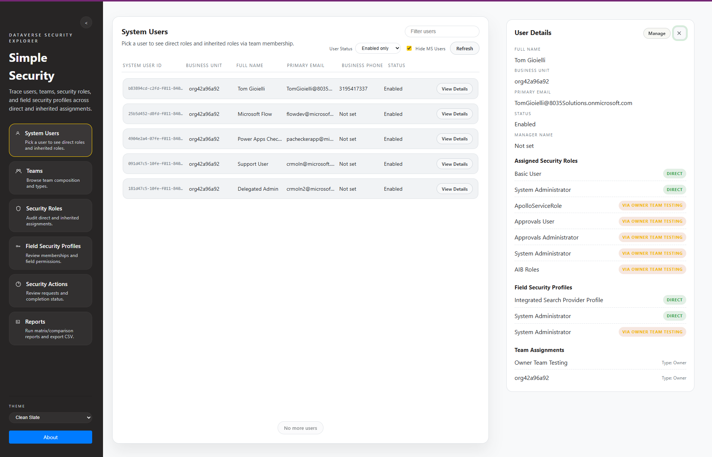
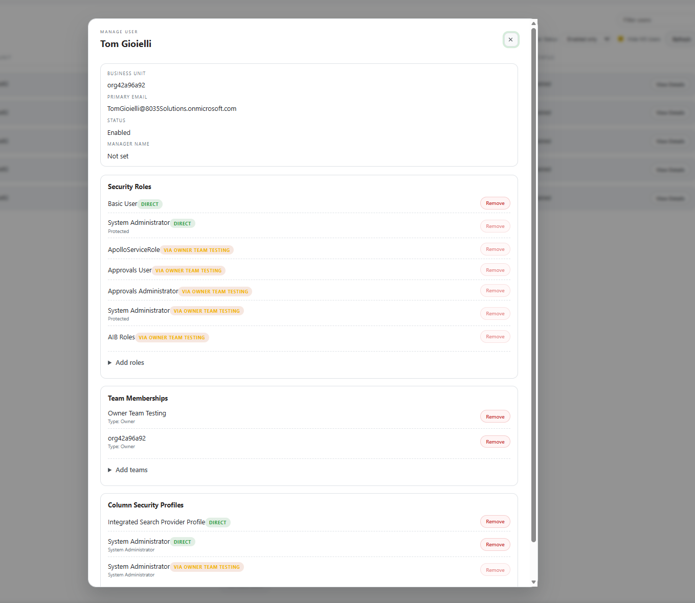
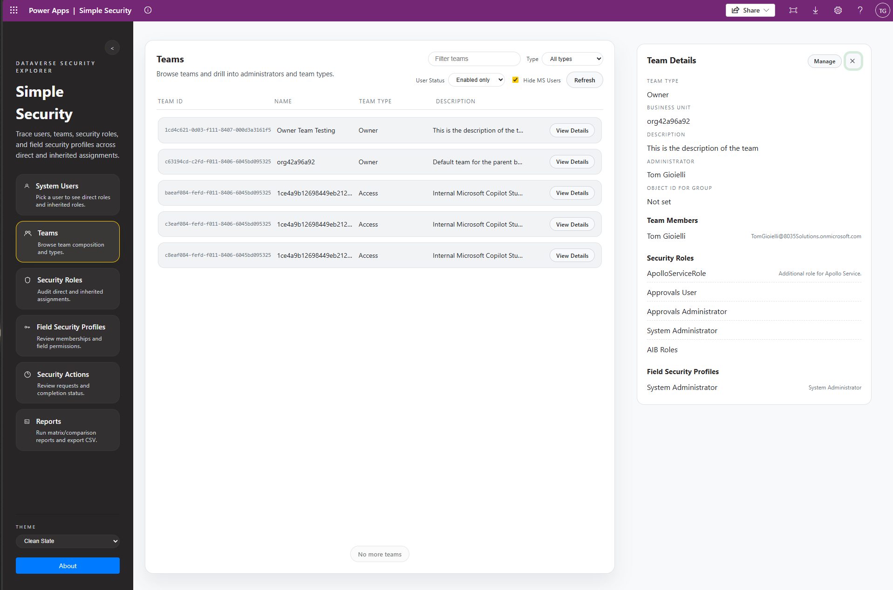
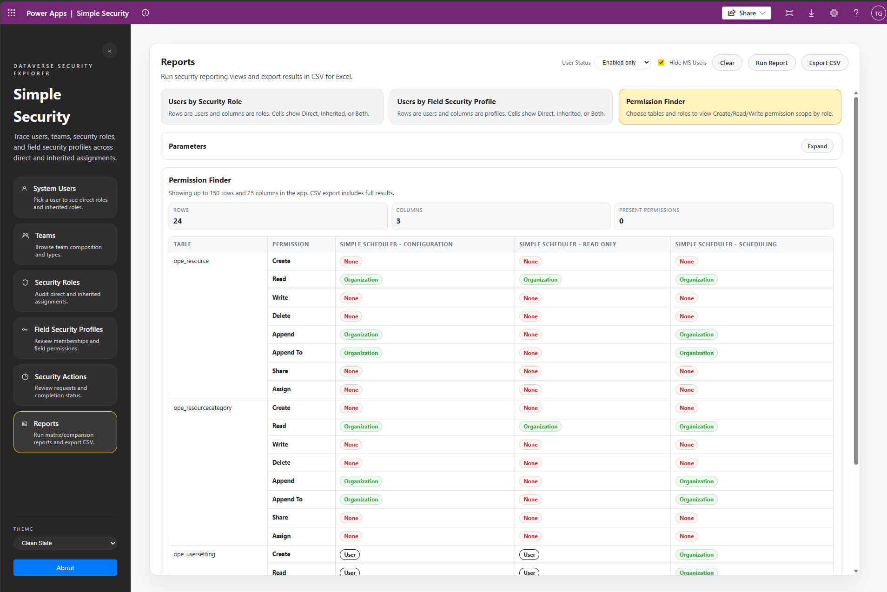

# Simple Security

Simple Security is a Power Platform app for reviewing and managing Dataverse security assignments from a single interface. No longer do you need to jump between the Power Platform Admin Center, Power Apps Maker portal, and the classic editor for Field Security profiles to manage and maintain your users.
- One Custom table, used to track and audit security actions performed through the app
- A single plugin to handle the associate and disassociate actions
- <b>Your data never leaves your tenant, and everything is handled according to Microsoft bext practices for Power Platform security </b>

## Key features

- Search and filter users, teams, roles, and field security profiles
- Manage associations (add/remove) from the app interface from the perspective of users, teams, security roles, and column security profiles
- View direct and inherited assignment context (no more sleuthing to find inherited security permissions!)
- Track and audit changed to security in custom table
- Export report output to CSV

### View and Find all Users and see their assigned and inherited roles, profiles, and teams

### View and manage security roles, teams, and column security profiles assigned to users

### View and manage security roles, users, and column security profiles assigned to teams

### Multiple reports available around security and permissions

## What the app includes

- React/TypeScript app UI for security management workflows
- Dataverse data access layer generated for required tables
- Custom audit table: `ope_simplesecurityactions`
- Custom Plugin to manager association/disassociation actions from directly in the app and through the custom audit table

## Included Reports

### Users by Security Role
Matrix view showing role coverage by user with direct/inherited visibility.

### Users by Field Security Profile
Matrix view showing profile coverage by user with direct/inherited visibility.

### Permission Finder
Comparison view showing role-level table permissions side-by-side.

## Installation
For managed deployment steps, use:

- [MANAGED_SOLUTION_INSTALLATION.md](MANAGED_SOLUTION_INSTALLATION.md)

## Operations
For day-to-day usage:

- [OPERATIONS_GUIDE.md](OPERATIONS_GUIDE.md)
