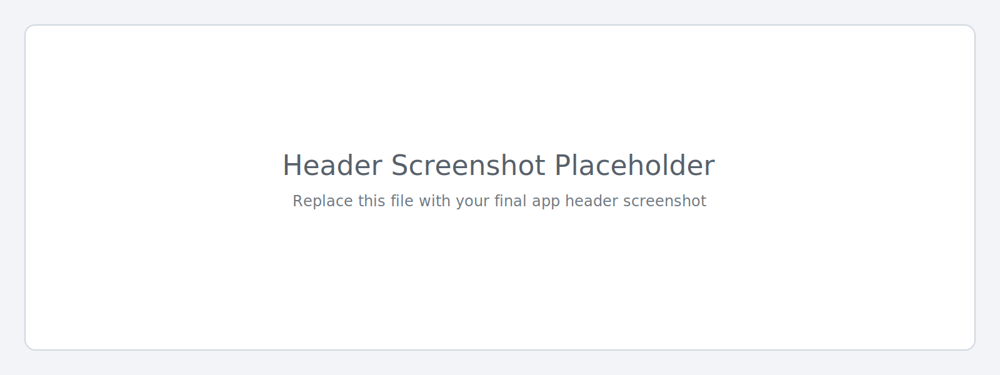
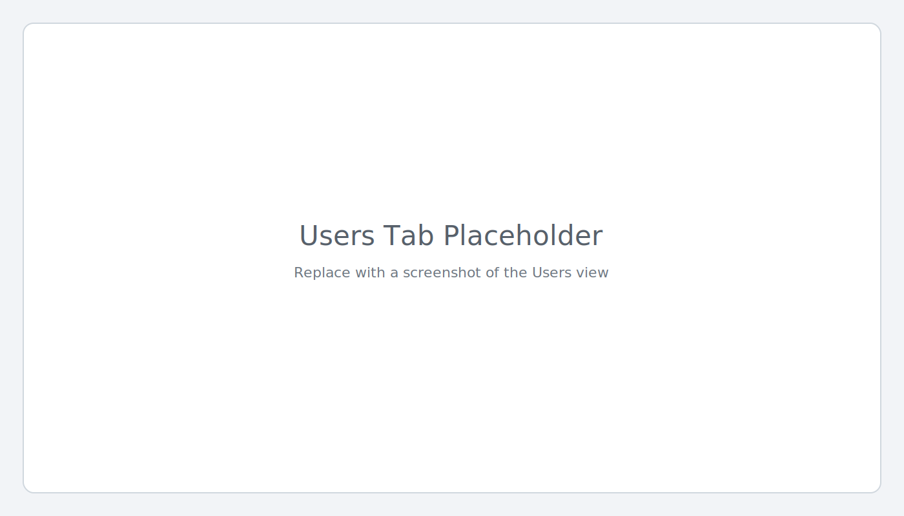
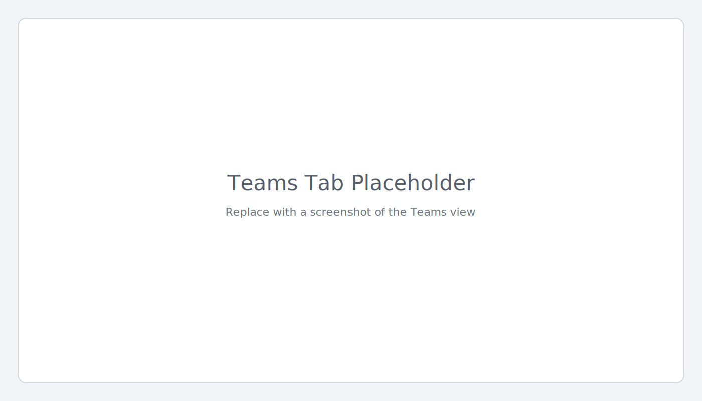
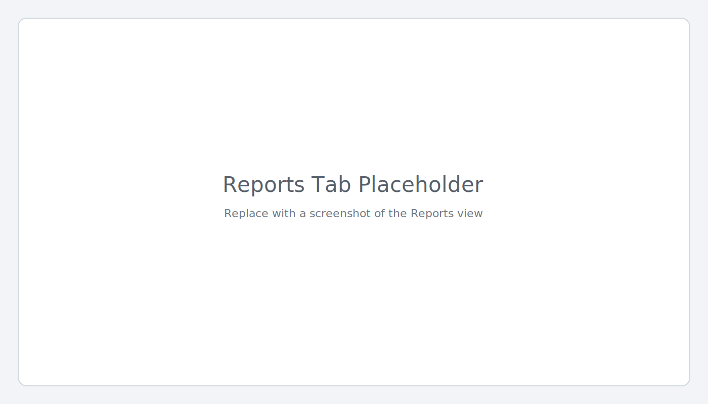

# Simple Security

Simple Security is a Power Platform app for reviewing and managing Dataverse security assignments from a single interface.

It helps administrators quickly work with:

- User security roles
- Team security roles and team memberships
- Field security profile assignments
- Action history for security changes

## Add screenshots/images

Use this section to add release screenshots.

### Header image

### Users tab

### Teams tab

### Reports tab

## What the app includes

- React/TypeScript app UI for security management workflows
- Dataverse data access layer generated for required tables
- Custom audit table: `ope_simplesecurityactions`
- Managed solution components required for processing association/disassociation requests

## Key features

- Search and filter users, teams, roles, and field security profiles
- Manage associations (add/remove) from the app interface
- View direct and inherited assignment context
- Track request status and outcomes in **Security Actions**
- Export report output to CSV

## Reports included

### Users by Security Role

Matrix view showing role coverage by user with direct/inherited visibility.

### Users by Field Security Profile

Matrix view showing profile coverage by user with direct/inherited visibility.

### Permission Finder

Comparison view showing role-level table permissions side-by-side.

## Installation

For managed deployment steps, use:

- [MANAGED_SOLUTION_INSTALLATION.md](MANAGED_SOLUTION_INSTALLATION.md)

## Operations

For day-to-day usage:

- [OPERATIONS_GUIDE.md](OPERATIONS_GUIDE.md)
